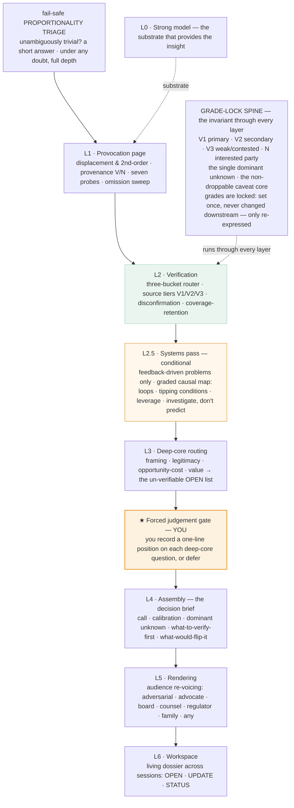
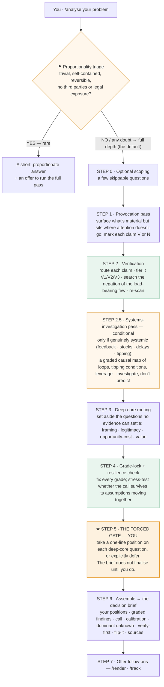

# Insight Engine — User Operating Guide

**`v0.1.8`** · A tool for investigating high-stakes, complex, contested, and wicked problems — the kind where the important things hide, the evidence is mixed or interested, and the deciding questions are value judgements. The engine surfaces the hidden contributors, conditions, and causal structure beneath a situation — sources of success and adaptation as well as failure — verifies every load-bearing claim against current sources, and routes what cannot be verified to your judgement. It offers understanding and a defensible next step, not control or prediction: wicked problems are navigated, not solved. **The large language model provides the insight; the engine makes it verified, defensible, and audience-ready.**

> This is the Markdown edition, for reading on GitHub. The original styled version (with the rich diagrams) is in [`originals/`](originals/) and on the [project site](https://complexar.github.io/Insight-Engine/).

## 1. What it's for (and when not)

Reach for the Insight Engine when a decision matters and the surface is not the whole story — a strategy call, a post-incident review, a contract or regulatory question, an investment, a contested situation where you need to know what is really going on and how strongly you actually know it.

It is not a search box or a chatbot. It is a discipline: **verify what can be verified, grade how strongly each claim is established, separate fact from value, and make you own the value calls.** What you get back is a graded, defensible analysis and a decision brief — and, on request, the same analysis re-voiced for a particular reader, or kept live as an investigation.

> You don't need it for genuinely trivial things. It will notice triviality and right-size itself to a short answer — but you get the most from it on problems that actually have hidden depth.

## 2. Quick start

The engine is the `insight-engine` plugin. To update, re-install the latest `.plugin` from **Customize → Skills**. You drive it with four chat commands:

- **`/analyse`** — The main one. Hand it a problem in your own words, or attach a document and say "analyse this."
- **`/verify`** — Fact-check a set of claims or a premise before you rely on it.
- **`/render`** — Re-voice a finished analysis for a specific reader.
- **`/track`** — Keep an investigation live across sessions as new facts arrive.

**Simplest use:** type `/analyse` followed by your problem, answer the gate when it asks, and read the brief.

### A worked first run (what to expect)

Say you run:

> `/analyse` Our 40-person firm is about to sign a 5-year exclusive deal with one software vendor. The discount is 30%. Worth it?

What happens, in order:

1. **Triage** — not trivial (a 5-year lock-in, material money), so the full pass runs.
2. **Scoping (optional)** — up to five short questions: the trouble and why now; whose problem it is and who will read the answer; what a good outcome and a serious cost look like; what is fixed and in scope; any documents only you hold (the draft contract). Skip any or all — skipped items become stated assumptions, and if you skip scoping entirely the engine states its own one-line problem statement (trouble, owner, core question) as an assumption before proceeding.
3. **Findings arrive graded** — for example: the vendor's "guaranteed 99.9% uptime" rests on its own marketing `[N]`; a 30% discount is roughly the market norm for 5-year exclusivity `[V2]`, so it is payment for the lock-in, not a favour; exit costs sit in the contract you hold — *party-held*: the draft's termination schedule would settle it.
4. **The gate** — before the brief is finalised, the engine asks you, one question at a time, things like: *"This framing treats the decision as sign / don't sign. Is renegotiating scope or term a live option?"* (example answer: "Yes — a 3-year non-exclusive at 20% is acceptable"), with *"I don't know — explain this"* and *defer* always available. Your one-line positions go on the record at the top of the brief.
5. **The decision brief** — the call (provisional if values dominate), calibration, the dominant unknown (here: the termination schedule), what to verify first (read that schedule), what would flip the call — then sources and the plain-language legend.

Nothing in the run predicts the future or makes the value calls for you; that part is deliberately yours.

## 3. The components

The engine is a stack of layers (L0–L6) held together by an invariant **grade-lock spine** and owned, at one critical point, by you. A fail-safe **proportionality triage** sits in front of it and decides whether the full machinery should run at all.

**The four skills (the interface):** `/analyse` orchestrates the whole pipeline (triage → L1–L6 with the gate); `/verify` is L2 standalone; `/render` is L5 standalone; `/track` is L6 standalone.

In short: **L0** the model is the substrate; **L1–L6** are the processing layers; the **spine** is the epistemic backbone that never bends; the **gate** is where you act; the **triage** decides how much machinery to run.

## 4. How it works

Here is what actually happens when you hand it a problem. Most of the pipeline runs silently — the one place it stops for you is the gate.

From Step 4 onward the **grade-lock spine** holds: grades never change — they are only re-expressed.

**Step 2.5 is new in v0.1.7 and conditional.** When a problem is genuinely *systemic* — driven by feedback loops, accumulating pressures, delays, or a possible tipping point — the engine adds a **systems-investigation pass**: a graded causal map of the loops, the *conditions* under which the system could tip (never a date or a probability), and the highest-leverage places to intervene. It investigates the structure and routes the "will it / when" judgement to you; it never forecasts. On a static, one-shot problem it skips this step and says so.

## 5. Using `/analyse`

**What to type:** `/analyse` and your problem in plain words, the specific questions you want answered, or a document to analyse — it will answer your questions inside the graded analysis. The more raw the problem (rather than a pre-digested summary), the more the engine can surface what you might have framed out.

**What it does:** runs the pipeline above. You may see it search the web — that is verification, grading each load-bearing claim and searching for evidence that would *disprove* the ones the conclusion rests on.

**What you get:** a written analysis led by your gate positions, the graded findings (each marked and tiered), and a five-part decision brief.

## 6. Clearing the gate — the one moment that's yours

Part-way through, the engine stops and puts two to four **deep-core questions** to you, one at a time — about the framing, the legitimacy, the opportunity cost, or the values at stake. These have no verifiable answer; they are judgements only you can make. You can:

- **Take a position** — a single line on each is enough.
- **Override the engine's framing** — encouraged. If you disagree with how it has framed the problem, say so; it will reshape the brief around your judgement.
- **Ask for help** — every question arrives with a one-line example answer; choose *"I don't know — explain this"* and the engine explains it in plain language, then asks again.
- **Defer** — logged, not ignored; the brief notes it as open.

The gate opens by asking for your own standpoint in one line, and closes with a stop-record — why this position is good enough for now. Where the systems pass ran, it also asks at what level to intervene: this problem, or the problem it is a symptom of.

> **Why it's forced.** The engine learned, by test, that if these questions are merely *shown* to you they get read and then ignored — attention slides to the verifiable. Being made to take a position is what gets the value questions actually addressed. In real use, an operator's override at the gate materially reshaped the final brief. This is the engine's most valuable interaction; treat it as the decision, not a form to clear.

## 7. Reading the output

### The grade markers

Every load-bearing claim is marked. `[V]` = independently corroborated; `[N]` = rests on an interested or self-reporting party. A `[V]` always carries a strength tier: `[V1]` primary (the regulation, the official statistic, the study), `[V2]` secondary (reputable reporting on top of primaries), `[V3]` weak or contested. The `[V3]` and `[N]` items are where the analysis is exposed — that is where to push. Every full-pass deliverable also ends with a fixed plain-language legend restating these markers in one sentence each — you never need this guide open to read a brief.

### The decision brief (always five parts)

- **The call** — the actual recommendation.
- **Calibration** — how sure, and the conditions under which it changes (it will name the weakest grade the call leans on).
- **The dominant unknown** — the one fact that would most change the conclusion. Chase this first.
- **What to verify first** — the cheapest next step that most reduces risk.
- **What would flip the call** — including any assumptions that, moved together, the call could not survive.

### Two things that always travel with it

A one-line **reliability caveat** naming what the analysis rests on; and, for a wicked problem with no verifiable solution, the "call" arrives as a **provisional stance** — the value it trades and what would re-open it — rather than a false-confident verdict. That is deliberate.

### Optional finding tags (hard / soft / messy)

Findings in a brief may carry an optional tag borrowed from systems engineering (Madhavan, 2024), naming what kind of component each finding is and what a response can honestly aim at:

- **hard** — bounded and optimisable; the matched verb is *solve*.
- **soft** — behavioural or political; there is no optimum, only a defensible accommodation; the verb is *resolve* (by satisficing).
- **messy** — rooted in conflicting values or beliefs; the verb is *dissolve* (reframe the situation until the problem cannot arise in that form).

A wicked problem is usually all three colliding, which is why one crisp verdict cannot fit every finding. Tags are reporting vocabulary only — they change no grade and add no pipeline step.

## 8. The other three skills

- **`/verify`** — Hand it a set of claims or a premise. It routes each (web-checkable / your-document / value-judgement), grades and tiers them, searches for counter-evidence, and tells you which are exposed. Use it to check something before you rely on it.
- **`/render`** — Takes a finished analysis and re-voices it for a reader. It will ask who — or you name them: a board, counsel, a regulator, a journalist, the family, an adversary. The grades never change; only the register does.
- **`/track`** — For inquiries that evolve. **OPEN** starts a dossier; **UPDATE** folds in new facts and re-verifies; **STATUS** reads back where it stands. (Newest skill — sound, but the least battle-tested.)
- **Chaining them** — A natural flow: `/analyse` a problem → `/render` it for each stakeholder → `/track` it as the situation develops. `/verify` can be used at any point to re-check a claim.

## 9. Tips for good results

- **Give it the raw problem**, not a tidy summary — it verifies, and it surfaces what a tidy summary has already framed out.
- **Upload the documents you hold** (contracts, figures). It will not pretend to verify what it cannot see, but it will use what you give it and name what would settle the rest.
- **Answer the gate honestly, and override it when you disagree.** That is the point of the gate.
- **Don't rewrite for a different reader** — use `/render`; the grades stay intact.
- **For something that will change, use `/track`** rather than re-running from scratch.
- **Trust the tiers.** A `[V1]` is solid; a `[V3]` or `[N]` the call leans on is the soft spot — push there.

## 10. What it won't do

- It won't over-analyse a genuinely trivial decision — it right-sizes, so don't be surprised by a short answer (you can always ask for the full pass).
- It won't pseudo-verify a private document — it names what would settle it.
- It won't resolve your value questions — it forces *you* to.
- It won't change a grade to suit an audience.
- It won't convene real stakeholders — it names every affected party and can render their perspectives, but a simulated perspective is labelled as such and is not participation; the people bound by a wicked call still have to be brought in by you.
- It won't design interventions or trials — it tells you what to verify first and what would flip the call; staging, piloting, and reversible-trial design are routed to you and your specialists.
- It won't simulate quantitatively — the systems pass investigates and grades structure; when genuine modelling is needed it says so and routes out.
- It won't intervene in power — where evidence shows outcomes are power-determined, the brief says "power problem, not an analysis problem" instead of pretending analysis can settle it.

## 11. Glossary

| Term | Meaning |
|---|---|
| `[V]` / `[N]` | A claim is **[V]** (independently corroborated) or **[N]** (rests on an interested or self-reporting party). |
| `[V1]` / `[V2]` / `[V3]` | Source-strength tiers on a [V] — how strong the corroborating source itself is. The tier is part of the grade: it travels with the claim and is never dropped. |
| `[V1]` — primary | The strongest tier: the claim is confirmed against the authoritative source itself — the text of the regulation or statute, the court ruling, the official statistic or regulator publication, the peer-reviewed study, the primary dataset or standard. Nothing stands between the claim and its evidence. |
| `[V2]` — secondary | Confirmed against reputable reporting or interpretation resting on primary sources — an established news organisation, a professional body, a textbook, a well-regarded analyst. Reliable, but one step removed; where it can, the engine names the primary source that would lift the claim to `[V1]`. |
| `[V3]` — weak or contested | The weakest [V]: the claim is corroborated only by weaker or interested sources (a single blog, a content aggregator, advocacy material, a party's own publications) — or credible sources genuinely disagree, so it is true-but-disputed. The specific weakness is named and travels with the claim. A `[V3]` the call leans on is where the analysis is most exposed: treat it as the first thing to verify further. |
| Dominant unknown | The single fact that, if known, would most change the conclusion. |
| Deep core | The questions no evidence can settle — framing, legitimacy, opportunity cost, value. Yours to judge. |
| The gate | The forced step where you take a position on each deep-core question before the brief finalises. |
| Grade-lock | Once set, a claim's grade never changes downstream — only its wording does. What makes the output defensible. |
| Disconfirmation | For load-bearing claims, a second search aimed at *disproving* them — the counter to confirmation bias. |
| Coverage-retention | A re-scan for material issues that focusing on the load-bearing few may have dropped. |
| Systems-investigation pass | A conditional step (v0.1.7) for genuinely systemic problems: a graded causal map of feedback loops, tipping *conditions*, and leverage points — investigating structure, never predicting whether or when the system tips. |
| Proportionality triage | The fail-safe pre-flight that right-sizes the analysis — short answer for the unambiguously trivial, full depth otherwise. |
| Provocation page | The fixed one-page method applied verbatim every run — the engine's analytical L1. |
| Wicked problem | One with no verifiable solution, where the deep core dominates. The call comes as a provisional stance, not a verdict. |

---

**Insight Engine v0.1.8** — User Operating Guide. The large language model provides the insight; the engine makes it verified, defensible, and audience-ready. For the full design specification, layer-by-layer detail, and the controlled-testing record behind each feature, see the companion [Architecture](Architecture.md) document.
